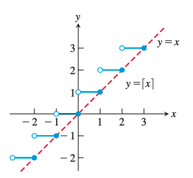
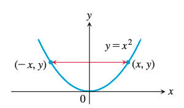
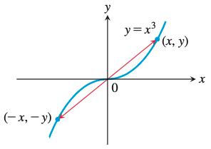
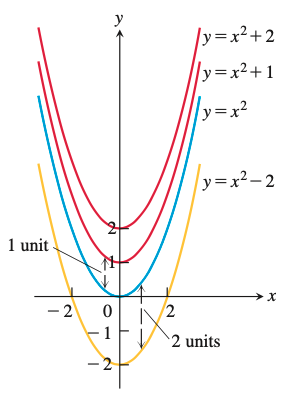
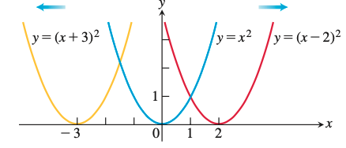
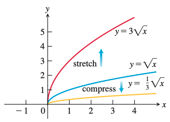
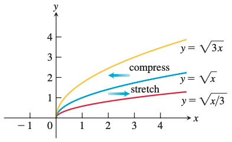
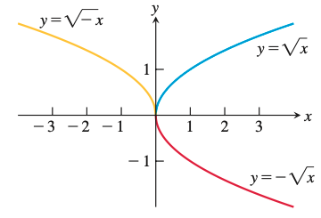

### 1. Functions

#### 1.1. Functions and Their Graphs

Functions are a tool for describing the real world in mathematical terms. 

A function can be represented by an **equation**, a **graph**, a **numerical table**, or a **verbal description**;

函数是用数学术语描述现实世界的工具。

函数可以用**方程**、**图形**、**数字表**或**口头描述**来表示；

&emsp;

The value of one variable quantity, say y, depends on the value of another variable quantity, which we often call x. We say that “y is a function of x”.

一个变量（比如 y）的值取决于另一个变量（我们通常称之为 x）的值。我们说 "y 是 x 的函数"。

&emsp;

$y = f(x)$

f: function 函数

x: **independent variable**, input value to f  **自变量**，f的输入值

y: **dependent variable**, output of f at x  **因变量**，f在x处的输出值

&emsp;

**DEFINITION**

 A function ƒ from a set D to a set Y is a rule that assigns a unique value ƒ(x) in Y to each x in D.

从集合 D 到集合 Y 的函数 ƒ 是一条规则，它将 Y 中的唯一值 ƒ(x) 赋给 D 中的每个 x。

D: all possible input, **domain**  所有可能输入，**域**

&emsp;

The set of all output values of ƒ(x) as x varies throughout D is called the **range** of the function. 

The range **might not include** every element in the set Y.

当 x 在整个 D 中变化时，ƒ(x) 的所有输出值的集合称为函数的范围。

范围**可能不包括**集合 Y 中的每个元素。

&emsp;

If ƒ is a function with domain D, its graph consists of the points in the **Cartesian plane** whose coordinates are the input-output pairs for ƒ.

如果 ƒ 是一个具有域 D 的函数，那么它的图由**笛卡尔平面**上的点组成，这些点的坐标是 ƒ 的输入输出对。

$\{(x,f(x))|x\in{D}\}$

&emsp;

A function f can have only one value f(x) for each x in its domain, so **no vertical line can intersect the graph of a function more than once**.

函数f在其域中的每个 x 只能有一个值 f(x)，因此**任何垂直线都不能与函数图形相交多次**。

&emsp;

A circle cannot be the graph of a function, since some vertical lines intersect the circle
twice.

圆不可能是函数的图形，因为有些垂直线与圆相交两次。

&emsp;

**greatest integer function / integer floor function**: **最大整数函数/整数下限函数**

value at any number x is the greatest integer less than or equal to x.

在任意数 x 上，其值为小于或等于 x 的最大整数。

$\lfloor \ \rfloor$

- $\lfloor2.4\rfloor = 2$

- $\lfloor-1.2\rfloor=-2$

**least integer function / integer ceiling function: 最小整数函数/整数上限函数**

value at any number x is the smallest integer greater than or equal to x.

在任意数 x 上，其值为大于或等于 x 的最小整数。

$\lceil \ \rceil$

- $\lceil2.4\rceil=3$

- $\lceil-1.2\rceil=-1$

**Even Functions and Odd Functions: Symmetry 偶函数与奇函数：对称性**

The names even and odd come from powers of x

所谓奇和偶取决于x的幂。

- **even function** $f(-x) = f(x)$, symmetric about the y-axis 绕y轴对称

- **odd function** $f(-x)=-f(x)$, symmetric about the origin 关于原点对称

&emsp;

- **Linear Function: $f(x)=mx+b$** 线性函数

- **Power Function: $f(x)=x^a$** 幂函数

- **Polynomials: $p(x)=a_nx^n+a_{n-1}x^{n-1}+\dots+a_1x+a_0$** 多项式

- **Rational Function: $f(x)=\frac{p(x)}{q(x)}$, p and q are polynomials** 有理函数

- **Algebraic Function: constructed from polynomials using algebraic operations $+ ,-,\times,\div, \sqrt{}$**, all rational functions are algebraic, but also included are more complicated functions, like $y^3-9xy+x^3=0$ 任何用代数运算从多项式构造的函数都属于代数函数, 所有有理函数都是代数函数，但也包括更复杂的函数。

- **Trigonometric Function** 三角函数

- **Exponential Function: $f(x)=a^x$, where $a>0$ and $a\neq1$** 指数函数

- **Logarithmic Function: $f(x)=log_ax$, where $a>0$ and $a\neq1$** 对数函数

- **Transcendental Function** 超越函数

---

#### 1.2. Combining Functions; Shifting and Scaling Graphs

For $x\in {D(f)}\cap{D(g)}$

- **$(f+g)(x)=f(x)+g(x)$**

- **$(f-g)(x)=f(x)-g(x)$**

- **$(fg)(x)=f(x)g(x)$**

For $x\in {D(f)}\cap{D(g)},g(x)\neq0$

- **$(\frac{f}{g})(x)=\frac{f(x)}{g(x)}$**

&emsp;

- **$(f\circ{g})(x)=f(g(x))$**

The domain of $f\circ g$ consists of the numbers $x$ in the domain of $g$ for which $g(x)$ lies in the domain of $f$.

$f\circ g$的域由g的域中使$g(x)$位于$f$的域构成。

- The definition implies that $f \circ g$ can be formed when the range of $g$ lies in the domain of ƒ. 
  
  该定义意味着，当$g$的范围位于$f$的域中时，可以形成$f \circ g$。

- To find $(f \circ g)(x)$, first find $g(x)$ and second find $f(g(x))$.
  
  要求$(f \circ g)(x)$，先求$g(x)$， 再求$f(g(x))$。

- The functions $f \circ g$ and $g \circ f$are usually quite different.
  
  $f \circ g$ 和$g \circ f$是完全不同的。

&emsp;

**Shifting a Graph of a Function**

- **Vertical Shifts: $y = f(x)+k$** 垂直运动

- **Horizontal Shifts: $y=f(x+h)$**, left if $h>0$; right if $h<0$ 水平运动 

**Vertical and Horizontal Scaling and Reflecting Formulas**

垂直与水平缩放、反射公式

- For $c>1$, scaled:
  
  - $y =cf(x)$, Stretches the graph of ƒ vertically by a factor of c. 
    
    垂直拉伸c倍图像
  
  - $y=\frac{1}{c}f(x)$, Compresses the graph of ƒ vertically by a factor of c. 
    
    垂直压缩c倍图像
  
  - $y=f(cx)$, Compresses the graph of ƒ horizontally by a factor of c.
    
    水平压缩c倍图像
  
  - $$y=f(\frac{x}{c})$, Stretches the graph of ƒ horizontally by a factor of c.
    
    水平拉伸c倍图像

- For $c=-1$, reflected:
  
  - $y=-f(x)$, Reflects the graph of ƒ across the x-axis.
    
     x 轴上反射图像
  
  - $y=f(-x)$, Reflects the graph of ƒ across the y-axis.
    
    y 轴上反射图像

---

#### Trigonometric Functions

